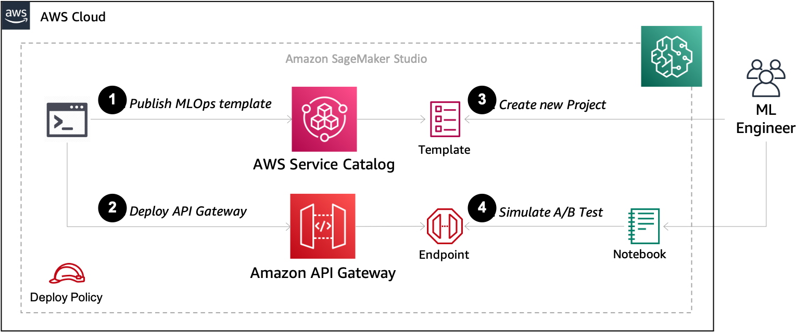
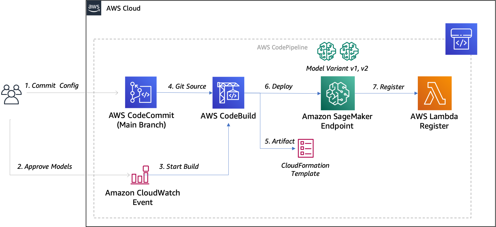
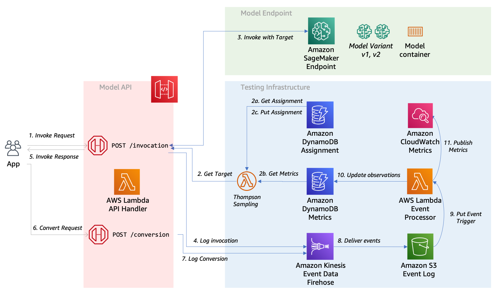
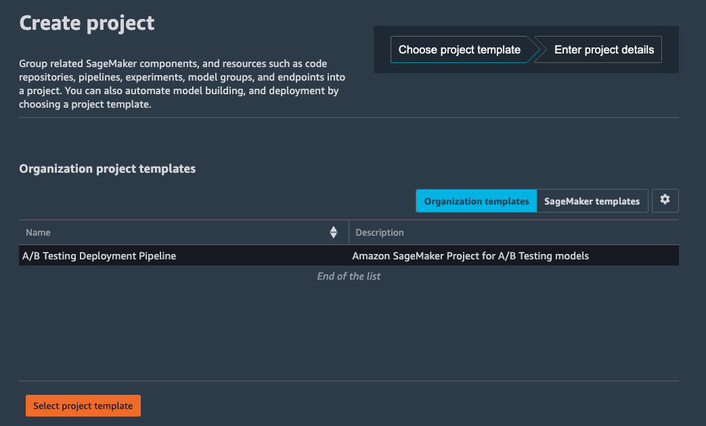
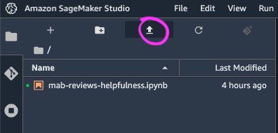

# Amazon SageMaker A/B Testing Pipeline 

This sample demonstrates how to setup an Amazon SageMaker MLOps deployment pipeline for A/B Testing of machine learning models.



The following are the high-level steps to deploy this solution:

1. Publish the SageMaker [MLOps Project template](https://docs.aws.amazon.com/sagemaker/latest/dg/sagemaker-projects-templates.html) in the [AWS Service Catalog](https://aws.amazon.com/servicecatalog/)
2. Deploy the [Amazon API Gateway](https://aws.amazon.com/api-gateway/) and Testing Infrastructure
3. Create a new Project in [Amazon SageMaker Studio](https://docs.aws.amazon.com/sagemaker/latest/dg/sagemaker-projects-create.]html)

Once complete, you can Train and Deploy machine learning models for A/B Testing in the sample notebook provided.

## Get Started

To get started first, clone this repository.

```
git clone https://github.com/aws-samples/amazon-sagemaker-ab-testing-pipeline.git
cd amazon-sagemaker-ab-testing-pipeline
```

## Prerequisites

This project uses the AWS Cloud Development Kit [CDK](https://aws.amazon.com/cdk/).  To [get started](https://docs.aws.amazon.com/cdk/latest/guide/getting_started.html) with AWS CDK you need [Node.js](https://nodejs.org/en/download/) 10.13.0 or later.

### Install the AWS CDK

Install the AWS CDK Toolkit globally using the following Node Package Manager command.

```
npm install -g aws-cdk
```

Run the following command to verify correct installation and print the version number of the AWS CDK.

```
cdk --version
```

### Setup Python Environment for CDK

This project uses AWS CDK with python bindings to deploy resources to your AWS account.

The `cdk.json` file tells the CDK Toolkit how to execute your app.

This project is set up like a standard Python project.  The initialization
process also creates a virtualenv within this project, stored under the `.venv`
directory.  To create the virtualenv it assumes that there is a `python3`
(or `python` for Windows) executable in your path with access to the `venv`
package. If for any reason the automatic creation of the virtualenv fails,
you can create the virtualenv manually.

To manually create a virtualenv on MacOS and Linux:

```
python3 -m venv .venv
```

After the init process completes and the virtualenv is created, you can use the following
step to activate your virtualenv.

```
source .venv/bin/activate
```

If you are a Windows platform, you would activate the virtualenv like this:

```
.venv\Scripts\activate.bat
```

Once the virtualenv is activated, you can install the required dependencies.

```
pip install -r requirements.txt
```

### Install Python Libraries for Lambda Layer

In order to support AWS X-RAY as part of our python function we require additional python libraries.

Run the following command to pip install the [AWS X-Ray SDK for Python](https://docs.aws.amazon.com/xray/latest/devguide/xray-sdk-python.html) into the `layers` folder.

```
sh install_layers.sh
```

This will enabling sample request to visualize the access patterns and drill into any specific errors.


### Add Permissions for CDK

AWS CDK requires permissions create AWS CloudFormation Stacks and the associated resources for your current execution role.  If you have cloned this notebook into SageMaker Studio, you will need to add an inline policy to your SageMaker Studio execution role.  You can find your user's role by browsing to the Studio dashboard.


Browse to the [IAM](https://console.aws.amazon.com/iam) section in the console, and find this role.

Then, click the **Add inline policy** link, switch to to the **JSON** tab, and paste the following inline policy:

```
{
    "Version": "2012-10-17",
    "Statement": [
        {
            "Effect": "Allow",
            "Action": [
                "apigateway:*"
            ],
            "Resource": "arn:aws:apigateway:*::/*"
        },
        {
            "Action": [
                "dynamodb:*"
            ],
            "Effect": "Allow",
            "Resource": "arn:aws:dynamodb:*:*:table/ab-testing-*"
        },
        {
            "Action": [
                "lambda:*"
            ],
            "Effect": "Allow",
            "Resource": [
              "arn:aws:lambda:*:*:function:ab-testing-api-*",
              "arn:aws:lambda:*:*:layer:*"
            ]
        },
        {
            "Action": [
                "firehose:*"
            ],
            "Effect": "Allow",
            "Resource": "arn:aws:firehose:*:*:deliverystream/ab-testing-*"
        },
        {
            "Action": [
                "s3:*"
            ],
            "Effect": "Allow",
            "Resource": [
                "arn:aws:s3:::cdktoolkit-*",
                "arn:aws:s3:::ab-testing-api-*"
            ]
        },
        {
            "Action": [
                "cloudformation:*",
                "servicecatalog:*",
                "events:*"
            ],
            "Effect": "Allow",
            "Resource": "*"
        },
        {
            "Effect": "Allow",
            "Action": [
                "logs:*"
            ],
            "Resource": "arn:aws:logs:**:*:log-group:ab-testing-api-*"
        },
        {
            "Effect": "Allow",
            "Action": [
                "iam:CreateRole",
                "iam:DeleteRole"
            ],
            "Resource": "arn:aws:iam::*:role/ab-testing-api-*"
        },
        {
            "Effect": "Allow",
            "Action": [
                "iam:GetRole",
                "iam:PassRole",
                "iam:GetRolePolicy",
                "iam:AttachRolePolicy",
                "iam:PutRolePolicy",
                "iam:DetachRolePolicy",
                "iam:DeleteRolePolicy"
            ],
            "Resource": [
              "arn:aws:iam::*:role/ab-testing-api-*",
              "arn:aws:iam::*:role/service-role/AmazonSageMaker*"
            ]
        }
    ]
}
```

Click **Review policy** and provide the name `CDK-DeployPolicy` then click **Create policy**

### Bootstrap the CDK

If this is the first time you have run the CDK, you may need to [Bootstrap](https://docs.aws.amazon.com/cdk/latest/guide/bootstrapping.html) your account.  If you have multiple deployment targets see also [Specifying up your environment](https://docs.aws.amazon.com/cdk/latest/guide/cli.html#cli-environment) in the CDK documentation.

```
cdk bootstrap
```

You should now be able to list the stacks by running:

```
cdk list
```

Which will return the following stacks:

* `ab-testing-api`
* `ab-testing-pipeline`
* `ab-testing-service-catalog`

## Publish the API and AWS Service Catalog template

In this section you will publish the AWS Service Catalog template and Deploy the API and Testing infrastructure.

### Publish the SageMaker MLOps Project template 

In this step you will create a *Portfolio* and *Product* to provision a custom SageMaker MLOps Project template in the AWS Service Catalog and configure it so you can launch the project from within your SageMaker Studio domain. See more information on [customizing](docs/CUSTOM_TEMPLATE.md) the template, or import the template [manually](docs/SERVICE_CATALOG.md) into the AWS Service Catalog.



Resources include:
* **AWS CodeCommit** seeded with the source from the [deployment_pipeline](deployment_pipeline).
* **AWS CodeBuild** to produce **AWS CloudFormation** for deploying the **Amazon SageMaker Endpoint**.
* **Amazon CloudWatch Event** to trigger the **AWS CodePipeline** for endpoint deployment.

Run the following command to deploy the MLOps project template, passing the required `ExecutionRoleArn` parameter.  You can copy this from your SageMaker Studio dashboard as show above.

```
export EXECUTION_ROLE_ARN=<<sagemaker-studio-execution-role>>
cdk deploy ab-testing-service-catalog \
    --parameters ExecutionRoleArn=$EXECUTION_ROLE_ARN \
    --parameters PortfolioName="SageMaker Organization Templates" \
    --parameters PortfolioOwner="administrator" \
    --parameters ProductVersion=1.0
```

This stack will output the `CodeCommitSeedBucket` and `CodeCommitSeedKey` which you will need when creating the Amazon SageMaker Studio project.

`NOTE`: If you are seeing errors running the above command ensure you have [Enabled SageMaker project templates for Studio users](https://docs.aws.amazon.com/sagemaker/latest/dg/sagemaker-projects-studio-updates.html) to grant access to these resources in Amazon S3.

### Deploy the API and Testing infrastructure

In this step you will deploy an Amazon API Gateway and supporting resources to enable dynamic A/B Testing of any Amazon SageMaker endpoint that has multiple production variants.



Resources include:

* **Amazon API Gateway** and **AWS Lambda** functions for invocation.
* **Amazon DynamoDB** table for user variant assignment.
* **Amazon DynamoDB** table for variant metrics.
* **Amazon Kinesis Firehose**, **Amazon S3** Bucket and **AWS Lambda** for processing events.
* **Amazon CloudWatch Event** and **AWS Lambda** to register in service **Amazon SageMaker Endpoints**.

Run the following command to deploy the API and testing infrastructure with optional [configuration](docs/API_CONFIGURATION.md).

```
cdk deploy ab-testing-api
```

This stack will output the `ApiEndpoint` which you will provide to the A/B Testing sample notebook.

You’re done! Now it’s time to create a project using this template.

## Creating a new Project in Amazon SageMaker Studio

Once your MLOps project template is registered in *AWS Service Catalog* you can create a project using your new template.

1. Switch back to the Launcher
2. Click **New Project** from the **ML tasks and components** section.

On the Create project page, SageMaker templates is chosen by default. This option lists the built-in templates. However, you want to use the template you published for the A/B Testing Deployment Pipeline.

6. Choose **Organization templates**.
7. Choose **A/B Testing Deployment Pipeline**.
8. Choose **Select project template**.



9. In the **Project details** section, for **Name**, enter **ab-testing-pipeline**.
  - The project name must have 32 characters or fewer.
10. In the Project template parameters
  - For **StageName**, enter `dev` 
  - For **CodeCommitSeedBucket**, enter the `CodeCommitSeedBucket` output from the `ab-testing-service-catalog` stack
  - For **CodeCommitSeedKey**, enter the `CodeCommitSeedKey` output from the `ab-testing-service-catalog` stack
11. Choose Create project.


`NOTE`: If you have recently updated your AWS Service Catalog Project, you may need to refresh SageMaker Studio to ensure it picks up the latest version of your template.

## Train and Deploy machine learning models for A/B Testing 

In the following sections, you will learn how to **Train**, **Deploy** and **Simulate** a test against our A/B Testing Pipeline.

### Training a Model

Now that your project is ready, it’s time to train, register and approve a model.

1. Download the [Sample Notebook](notebook/mab-reviews-helpfulness.ipynb) to use for this walk-through.
2. Choose the **Upload file** button
3. Choose the Jupyter notebook you downloaded and upload it.
4. Choose the notebook to open a new tab.



This notebook will step you through the process of 
1. Download a dataset
2. Create and Run an Amazon SageMaker Pipeline
3. Approve the model.
4. Create a Amazon SageMaker Tuning Job.
5. Select the best model, register and approve the second model.

### Deploying the Multi-Variant Pipeline.

Once the second model has been approved, the MLOps deployment pipeline will run.

See the [Deployment Pipeline](deployment_pipeline) for more information on the stages to run.

### Running an A/B Testing simulation

With the Deployment Pipeline complete, you will be able to continue with the next stage:
1. Test the multi-variant endpoint
2. Evaluate the accuracy of the models, and visualize the confusion matrix and ROC Curves
3. Test the API by simulating a series of `invocation`, and recording reward `conversion`.
4. Plot the cumulative reward, and reward rate.
5. Plot the beta distributions of the course of the test.
6. Calculate the statistical significance of the test.

## Running Costs

This section outlines cost considerations for running the A/B Testing Pipeline. Completing the pipeline will deploy an endpoint with 2 production variants which will cost less than $6 per day. Further cost breakdowns are below.

- **CodeBuild** – Charges per minute used. First 100 minutes each month come at no charge. For information on pricing beyond the first 100 minutes, see [AWS CodeBuild Pricing](https://aws.amazon.com/codebuild/pricing/).
- **CodeCommit** – $1/month if you didn't opt to use your own GitHub repository.
- **CodePipeline** – CodePipeline costs $1 per active pipeline* per month. Pipelines are free for the first 30 days after creation. More can be found at [AWS CodePipeline Pricing](https://aws.amazon.com/codepipeline/pricing/).
- **SageMaker** – Prices vary based on EC2 instance usage for the Notebook Instances, Model Hosting, Model Training and Model Monitoring; each charged per hour of use. For more information, see [Amazon SageMaker Pricing](https://aws.amazon.com/sagemaker/pricing/).
  - The ten `ml.c5.4xlarge` *training jobs* run for approx 4 minutes at $0.81 an hour, and cost less than $1.
  - The two `ml.t2.large` instances for production *hosting* endpoint costs 2 x $0.111 per hour, or $5.33 per day.
- **S3** – Low cost, prices will vary depending on the size of the models/artifacts stored. The first 50 TB each month will cost only $0.023 per GB stored. For more information, see [Amazon S3 Pricing](https://aws.amazon.com/s3/pricing/).
- **API Gateway** - Low cost, $1.29 for first 300 million requests.  For more info see [Amazon API Gateway pricing](https://aws.amazon.com/api-gateway/pricing/)
- **Lambda** - Low cost, $0.20 per 1 million request see [AWS Lambda Pricing](https://aws.amazon.com/lambda/pricing/).

## Cleaning Up

Once you have cleaned up the SageMaker Endpoints and Project as described in the [Sample Notebook](notebook/mab-reviews-helpfulness.ipynb), complete the clean up by deleting the **Service Catalog** and **API** resources with the AWS CDK:

1. Delete the Service Catalog Portfolio and Project Template

```
cdk destroy ab-testing-service-catalog
```

2. Delete the API and testing infrastructure

Before destroying the API stack, is is recommend you [empty](https://docs.aws.amazon.com/AmazonS3/latest/userguide/empty-bucket.html) and [delete](https://docs.aws.amazon.com/AmazonS3/latest/userguide/delete-bucket.html) the S3 Bucket that contains the S3 logs persisted by the Kinesis Firehose.

```
cdk destroy ab-testing-api
```

## Want to know more?

The [FAQ](docs/FAQ.md) page has some answers to questions on the design principals of this sample.

See also the [OPERATIONS](docs/OPERATIONS.md) page for information on configuring experiments, and the API interface.

## Security

See [CONTRIBUTING](CONTRIBUTING.md#security-issue-notifications) for more information.

## License

This library is licensed under the MIT-0 License. See the [LICENSE](LICENSE) file.